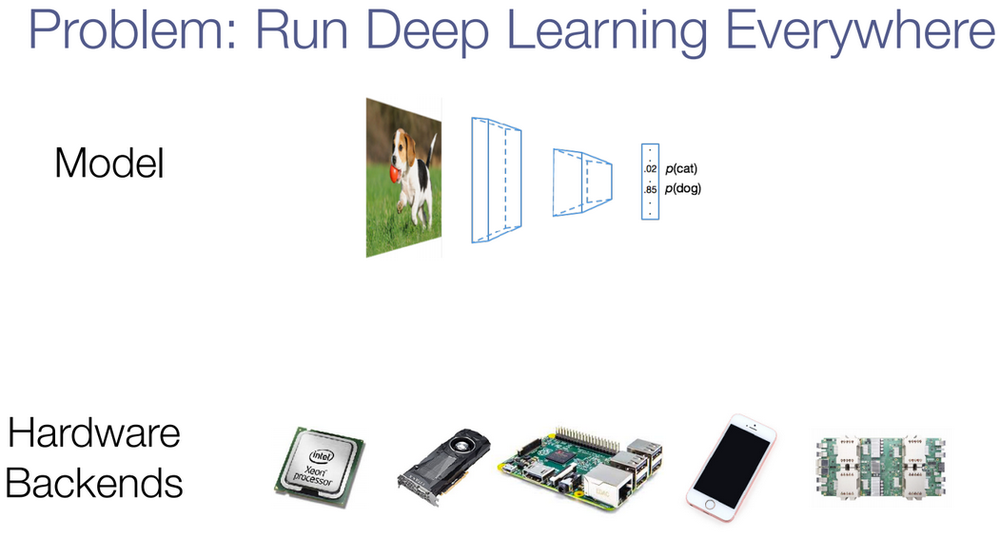
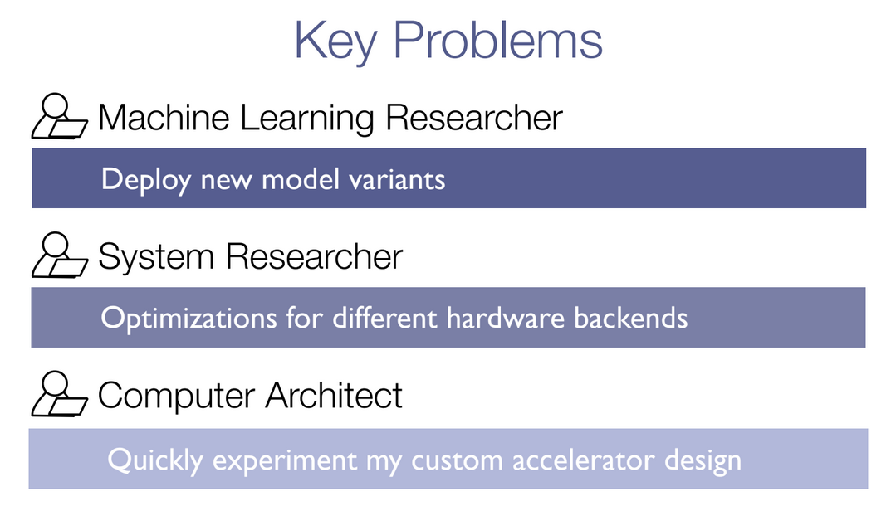
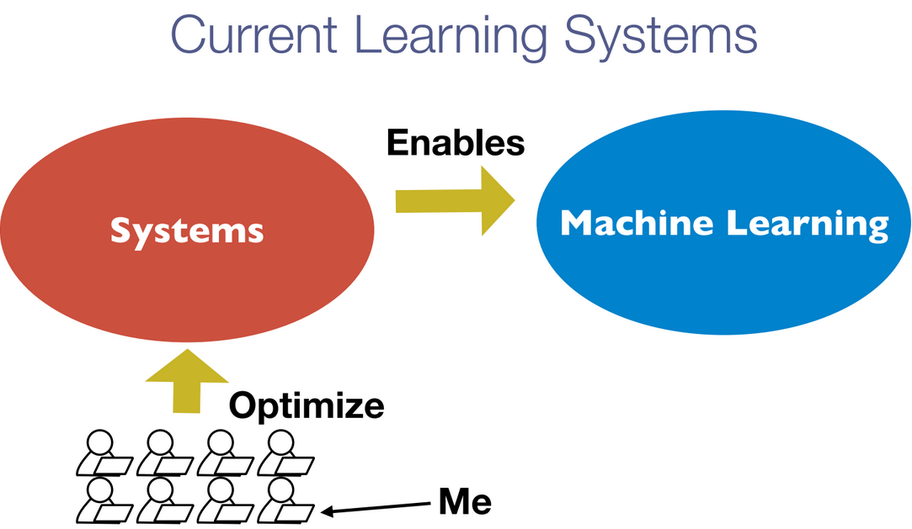
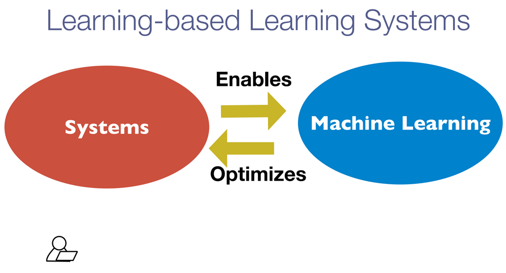

- [TVM Tutorial](https://sampl.cs.washington.edu/tvmfcrc/)
- [Slides-Overview of TVM](https://drive.google.com/file/d/1_j1dqKZG6Vfedwpzgz4XLD-YWS0e33ve/view)

## Problem: Run deep learning everywhere
- 
- For now, how I start to work on this problem ?
  - We need Machine Learning Reseacher, System Researcher and Computer Architect to work together.
  - 
  - **It's so resource-comsuming!!! So we propose TVM **
## TVM 
- Why ?
  - How to build intelligent systems with learning
  - End-to-end learning-based learning system stack
- Core idea, 能让计算机完成的任务绝不丢给人来做。
- Current System]
  - 现时的做法是我们先优化底层的系统层，然后令系统层赋予我们的机器学习层来优化。这是一个单向的过程，每次我们改变了机器学习算法，那么我们都得重新优化底层的系统来适应。那么，我们提出了这样的问题，我们可不可以直接利用机器学习算法来优化底层的系统呢？如果我们能完成这样的工作，那么底层系统和机器学习算法就会变成一个双向的过程，变成了一个相辅相成的关系。
  - 

  - 
  
