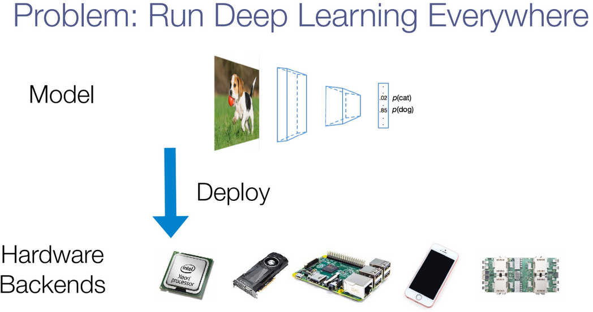

- [TVM Tutorial](https://sampl.cs.washington.edu/tvmfcrc/)
- [Slides-Overview of TVM](https://drive.google.com/file/d/1_j1dqKZG6Vfedwpzgz4XLD-YWS0e33ve/view)

## Problem: Run deep learning everywhere
- 
- For now, how I start to work on this problem ?
  - We need Machine Learning Reseacher, System Researcher and Computer Architect to work together.
  - 
