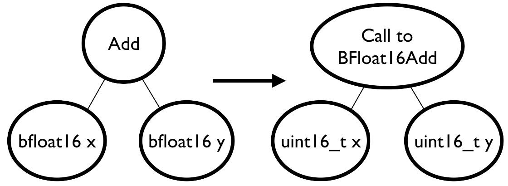

- [Translate from here](https://tvm.apache.org/2020/05/20/bring-your-own-datatypes)
- May 20, 2020 • Gus Smith

- 在本篇blog中，我们介绍了“带入你自己的数据类型框架”，就是在TVM中定义你自己的数据类型。

## Introduction
- 当我们设计加速算子时，其中一个很重要的决策就是我们在硬件中如何近似表示实数。这个问题有一个长期的工业标准的解决方案： the IEEE 754 floating-point standard. 但是，当我们尝试创建高度专业化的设计来压缩大多数的硬件时，使用IEEE 754 floats真的有效吗？ 如果我们知道我们工作负载的数值需求，我们就能创建一个较小的，快速的或者更加节能的数据类型呢？答案是肯定的！研究者们已经开始在学术和工业的加速设计上做了一些新的数据类型的实验。譬如，谷歌的TPU利用了**bfloat**类型：一个单精度被截到16个bits的IEEE float。由于大多数的深度学习框架中的数值需求定义的相对松弛， 这样的截断通常对模型的精度不做影响，另一方面却可以减少了模型大小的一半。

- 在研究人员开始为数据类型来创建硬件的时候，他们最先要确定的就是他们关心的工作负载中数据类型的表现数值。这常常关乎第一次创建的软件仿真的数据类型（譬如，[Berkeley SoftFloat](http://www.jhauser.us/arithmetic/SoftFloat.html)或者[libposit](https://github.com/cjdelisle/libposit)）,然后直接在工作负载中修改数据类型，去观察不同数据类型的不同表现。 或者更好的是直接把数据类型和编译器整合在一起，这样很多不同的工作负载都可以用这个数据类型来进行编译。这两种做法都是冗长的，而后一种由于给定现代编译器的size和complexity而变得难以操作。Github上的一个[例子](https://github.com/xman/tensorflow) 展示了在tensorflow中修改**posit**数据类型。结果是237个commits，增加了接近6000行代码和修改了超过200个文件，才能加入一个数据类型。这样的工作量对很多研究者来说是非常超过的。

- 为了解决这个问题，我们提出了“Bring Your Own Datatypes framework”. 这个框架更容易探索在深度学习工作负责中新的数据类型，通过允许用户在TVM中加入仿真的数据类型小插件。不像上面的Github例子中的**posit**，只是在编译器中加入了一个新的数据类型，我们的新框架可以加入各种各样的用户自定义的类型。

## Bring Your Own Datatypes
- 新框架的目的是使得用户能够用自定义的数据类型来跑深度学习的工作负载。在新框架中，**“数据类型”**代表一个标量：譬如**float32或者uint8**。我们不处理其他复杂的数据格式，像**[block floating point](https://en.wikipedia.org/wiki/Block_floating_point)**或者Intel的[Flexpoint](https://arxiv.org/abs/1711.02213)。另外，我们只是支持这些标量数据类型的软件仿真版本，我们不支持直接在硬件上编译和运行自定义的数据类型。

- TVM中每一个tensor都赋予一个类型编码，这个编码定义了在tensor中的标量的数据类型。 大多数的类型编码在TVM中都有硬编码的意义，它映射到一个常用的数据类型，譬如**int**和**float**。 但是，大多数的类型编码都是未使用的。新框架运行用户声明这些未使用的类型编码，并且在runtime中加入新的数据类型。

- 新框架是通过注册来实现的，和TVM的常用数据类型一样。有2中方法来让用户声明新的数据类型：第一个，**datatype registration**，第二个，**lowering function registration**。这些步骤分别是用来声明和实现新的数据类型。

### Datatype Registration
- 要注册新的数据类型，用户需要赋予新的数据类型一个名字和一个类型编码， 这个类型编码来自自定义数据类型中未使用的类型编码。
``` python
tvm.datatype.register('bfloat', 150)
```
- 上面的代码注册了**bfloat**的数据类型，类型编码是150。这个注册步骤允许TVM来解析自定义的数据类型。
```python
x = relay.var('x', shape=(3, ), dtype='float32')
y = relay.var('y', shape=(3, ), dtype='float32')
x_bfloat = relay.cast(x, dtype='custom[bfloat]16')
y_bfloat = relay.cast(y, dtype='custom[bfloat]16')
z_bfloat = x_bfloat + y_bfloat
z = relay.cast(z_bfloat, dtype='float32')
program = relay.Function([x, y], z)
print(program)

# v0.0.4
# fn (%x: Tensor[(3), float32], %y: Tensor[(3), float32]) {
#   %0 = cast(%x, dtype="custom[bfloat]16");
#   %1 = cast(%y, dtype="custom[bfloat]16");
#   %2 = add(%0, %1);
#   cast(%2, dtype="float32")
# }
```
- 上面的程序代码把输入x和输出y从**float32**转换成了**bfloat**，把它们相加，然后再把结果转回**float32**。一旦注册了**bfloat**这个类型， TVM就能够同过语法custom[<typname>]解析特定的数据类型，其中typename就是已经定义的类型。这个语法同样也支持一般的<bits><lanes>的格式; 在这里，我们使用16来指名每一个bfloat都是16bits的定义范围的。lanes默认值是1。

### Lowering Function Registration
- 虽然TVM能解析上面的程序，但它并不能编译，因为TVM还没有理解该怎么编译上面定义的bfloat数据类型。为了编译这个程序，我们为新的数据类型注册了**lowering function**，这样能够帮助TVM转化新的数据类型，让TVM能够理解和编译的。

- 通常，用户不希望直接在LLVM和CUDA中降低算子操作。反而，大多数的代码使用自定义数据类型比不用自定义数据类型的代码能够减低效能，利用一些小tricks。我们可以依赖原来的TVM去理解和编译代码。
- 
- Figure 1: The expected result of a user's registered lowering function. A lowering function should convert a program using custom datatypes to a program which native TVM can understand and compile (in this case, a call to an external library, taking two uint16_ts).

- 图1展示了常规模式。让我们假设我们想要探索bfloat类型，然后通过新框架插入bfloat仿真库到TVM来运行工作负载。我们的工作负载是一个简单2个bfloate输入相加的程序。Native TVM不理解如何实现bfloat的相加，但是他不需要这样做，因为我们已经实现了我们的数据类型的库。这个库包含了bfloat的相加的实现，还包括其他的算子，譬如相乘或者求平方根。要实现这个bfloat相加，我们只需要调用我们的库就可以了。所以，我们的**add**算法就是一个被调用的节点，调用一个函数（我们的库中叫**BFloat16Add**）。为了存储输入bfloat的bits到TVM能够理解的类型中，我们利用16-bits无符号的整数。最后的程序是TVM能够理解和编译的，它就是简单的调用了一个外部的库函数，输入2个无符号的整数。

- 为了实现上面的lowering，我们为bfloat注册了一个lowering函数:
```python
tvm.datatype.register_op(
    tvm.datatype.create_lower_func('BFloat16Add'),
    'Add', 'llvm', 'bfloat')
```

- 上面的程序注册了一个lowering函数，针对特定的算子(Add)，编译目标(LLVM)，数据类型(bfloat)。第一个参数是lowering函数。 这也可以是任何的函数，输入是TVM IR节点，返回一个新的TVM IR节点。在我们的case中，我们使用了一个helper函数来提供新框架(Bring Your Own Datatypes framework). tvm.datatype.create_lower_func('BFloat16Add')创建了一个lowering函数，就是上面提及的常规模式。结果函数转换了给定节点，变成uint16_t，然后再把节点本身转换成给定名称的调用函数。（这里是BFloat16Add）.
